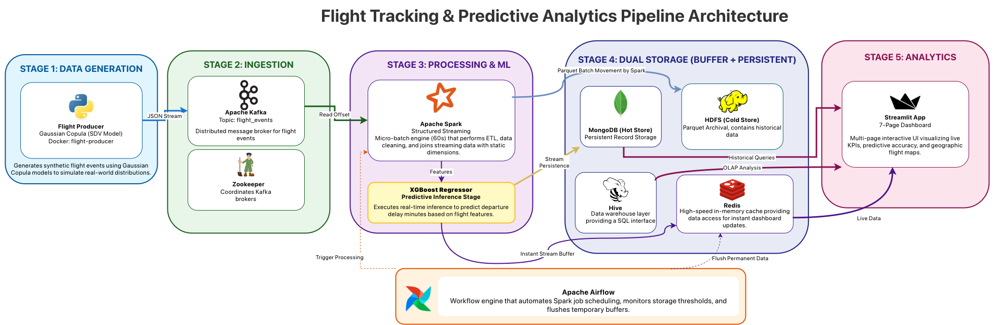

# Big Data Architecture: Real-Time Flight Analytics & Predictive Pipeline

**A comprehensive data engineering project for real-time ingestion, processing, storage, and predictive analytics of aviation data.**

---

### Business Problem
*   **Domain:** Aviation & Logistics
*   **Problem:** Flight delays cost the aviation industry billions annually. Identifying root causes (weather, carrier, or system congestion) in real-time is difficult due to the high velocity of incoming flight events.
*   **Goal:** 
    1. Provide a **Live Executive Dashboard** for monitoring flight operations and delay causes.
    2. Implement a **Predictive Model** that estimates arrival delays to allow for proactive resource allocation.
    3. Maintain a dual-tier storage system (**Hot/Cold**) for both operational speed and historical depth.

---

### Architecture

The pipeline is fully dockerized and orchestrated by Airflow, following a Lambda-style architecture to separate real-time "Hot" processing from archival "Cold" storage.


#### **Tech Stack**
| Component | Technology | Role |
| :--- | :--- | :--- |
| **Ingestion** | **Kafka** (w/ Zookeeper) | Buffers high-velocity streaming data from the flight generator. |
| **Orchestration** | **Apache Airflow** | Schedules micro-batches, model training, and data archival jobs. |
| **Processing** | **Apache Spark** (PySpark) | Handles ETL, stream-to-static joins, and ML inference. |
| **Hot Storage** | **MongoDB** | Serves as the real-time sink for the dashboard API. |
| **Cold Storage** | **HDFS** (Hadoop) | Long-term archival of raw and enriched data in Parquet format. |
| **Metadata** | **Hive Metastore** | Manages table definitions for analytical SQL querying. |
| **Caching** | **Redis** | Caches static dimension data (Airports, Airlines) for sub-millisecond joins. |
| **Visualization** | **Streamlit** | Multi-page frontend for monitoring KPIs and ML performance. |

---

### Data Dictionary & Schema

The following schema defines the core **Flight Events Stream** processed through the pipeline.

#### **Main Flight Event Schema**
| Column Name | Data Type | Description |
| :--- | :--- | :--- |
| `flight_id` | String | Unique identifier for each flight event (generated). |
| `timestamp` | Timestamp | Event generation timestamp (ISO 8601 format). |
| `AIRLINE_CODE` | String | IATA airline code (e.g., 'AA', 'DL'). |
| `ORIGIN` | String | IATA origin airport code (e.g., 'ATL'). |
| `DEST` | String | IATA destination airport code (e.g., 'LAX'). |
| `CRS_DEP_TIME` | Integer | Scheduled departure time (0-2400 format). |
| `DEP_DELAY` | Double | Departure delay in minutes (negative = early). |
| `ARR_DELAY` | Double | Arrival delay in minutes. |
| `DISTANCE` | Double | Flight distance in miles. |
| `DELAY_DUE_WEATHER` | Double | Delay attributed to weather (minutes). |
| `DELAY_DUE_CARRIER` | Double | Delay attributed to carrier operations. |
| `DELAY_DUE_NAS` | Double | Delay attributed to National Airspace System. |
| `DELAY_DUE_LATE_AIRCRAFT` | Double | Delay due to late-arriving aircraft. |
| `Month` | Integer | Month of flight (1-12). |
| `DayOfWeek` | Integer | Day of week (0=Monday, 6=Sunday). |

### Data Flow
1.  **Generation:** A Python producer simulates flight events based on statistical distributions from historical data, pushing JSON to **Kafka** topics.
2.  **Ingestion & Processing:** Airflow triggers a **Spark Streaming** job:
    *   Reads new offsets from Kafka.
    *   Enriches events by joining the stream with static data (Airline/Airport names) stored in **Redis**.
    *   Performs real-time aggregations (e.g., average delay per carrier).
3.  **Predictive Analytics:** The Spark job passes incoming features (`Month`, `DayOfWeek`, `DISTANCE`, `DEP_DELAY`) into a **pre-trained ML model** to predict the `ARR_DELAY`.
4.  **Storage:** 
    *   **Hot Store:** Enriched data + predictions are written to **MongoDB**.
    *   **Cold Store:** Raw events are archived to **HDFS** in compressed Parquet.
5.  **Archival & Purging:** An Airflow DAG monitors the MongoDB size. Once a 300MB threshold is reached, historical records are offloaded to HDFS and purged from the hot store.

---

### Dashboard & KPIs

The Streamlit dashboard provides 6 distinct views into the data:
1.  **Real-Time Overview:** Live counts of incoming flights and system latency.
2.  **Streaming Analytics:** Rolling window analysis of delays by `AIRLINE_CODE`.
3.  **Historical Analytics:** OLAP drill-downs into long-term delay trends.
4.  **Prediction & Insights:** Analysis of predicted vs. actual arrival delays.
5.  **Data Quality & Metadata:** Monitoring of missing values and Hive schema health.
6.  **Operations & Monitoring:** Visualization of Airflow DAG statuses and Spark job resource usage.

---

### Machine Learning Model
*   **Target:** `ARR_DELAY` (Arrival Delay in minutes).
*   **Features:** `Month`, `DayOfWeek`, `CRS_DEP_TIME`, `DISTANCE`, `DEP_DELAY`.
*   **Implementation:** A Random Forest Regressor trained on historical HDFS data. The model is persisted and loaded by the Spark Streaming job for real-time inference.

---

### How to Run

#### **Prerequisites**
*   Docker & Docker Compose (allocated min 4 GB RAM).
*   Python 3.8+

#### **Setup**
1.  **Clone the Repository:**
    ```bash
    git clone https://github.com/Saad-Imam/Flight-Tracking-Pipeline.git
    cd Flight-Tracking-Pipeline
    ```

2.  **Launch Environment:**
    ```bash
    docker-compose up -d --build
    ```
    This automatically starts the entire pipeline. No manual modification required!

3.  **Access Web UIs:**
    *   **Airflow:** `http://localhost:8080`
    *   **Dashboard:** `http://localhost:8501`
    *   **Spark Master:** `http://localhost:8081`

---

